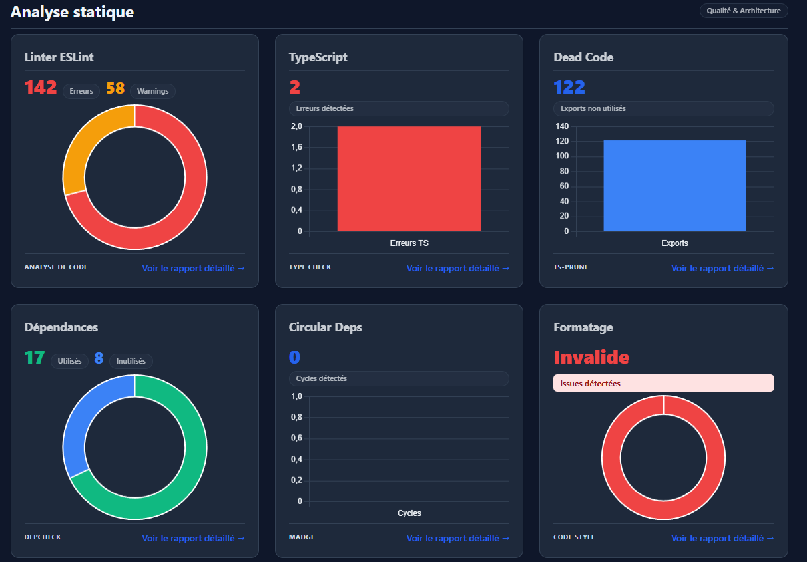

# Next.js Inspector


**Next.js Inspector** is a comprehensive Code Quality & Security Dashboard designed specifically for Next.js applications. It combines static analysis, code style checks, and security audits into a single, modern, and interactive HTML dashboard.

## Demo



## Features

- **Automated Tool Detection**: Automatically detects your package manager (`npm`, `pnpm`, `yarn`) and installs necessary tools.
- **Static Analysis**:
  - **TypeScript**: Type checking and compilation errors.
  - **ESLint**: Linter rules violations and statistics.
  - **Dead Code**: Detection of unused exports via `ts-prune`.
  - **Dependency Check**: Identification of unused and missing dependencies with `depcheck`.
  - **Circular Dependencies**: Detection of circular imports using `madge`.
  - **Prettier**: Code formatting validation.
  - **Next Build**: Validation of the production build process.
- **Security & Vulnerabilities**:
  - **Dependency Audit**: Checks for vulnerabilities in your dependencies (`npm/pnpm/yarn audit`).
  - **OSV-Scanner**: Scans for vulnerabilities in your project using the OSV database.
  - **Semgrep SAST**: Static Application Security Testing for finding security flaws in code.
  - **Gitleaks**: Scans for hardcoded secrets and credentials.
- **Modern Dashboard**:
  - **Dark/Light Mode**: Toggleable themes for comfortable viewing.
  - **Interactive Charts**: Visualizations of errors, warnings, and stats using Chart.js.
  - **Detailed Reports**: Drill-down pages for each analysis tool with full logs and raw data.
- **CI/CD Ready**: Generates exit codes and reports suitable for integration into CI pipelines (GitHub Actions, GitLab CI, etc.).

## Usage

This tool works locally and in CI environments. It supports **macOS**, **Linux**, and **Windows** (via Git Bash or WSL).

### Method 1: Direct Execution (Recommended)

Run the analyzer directly anywhere:

```bash
# Works on macOS, Linux, and Windows (Git Bash / WSL)
curl -fsSL https://raw.githubusercontent.com/mimpungu/nextjs-inspector/master/bin/analyze.sh | bash
```

### Method 2: Manual Download

Download the script and run it manually:

```bash
curl -fsSL https://raw.githubusercontent.com/mimpungu/nextjs-inspector/master/bin/analyze.sh -o analyze.sh
chmod +x analyze.sh
./analyze.sh
```

## Output

The tool generates a `reports/` directory in your project root:

- **`reports/raw/`**: Contains raw JSON and text output files from each tool (`eslint.json`, `gitleaks.json`, etc.).
- **`reports/html/`**: Contains the generated HTML dashboard.
  - Open `reports/html/index.html` in your browser to view the dashboard.

## Requirements

- **Node.js**: required.
- **Package Manager**: npm, pnpm, or yarn.
- **Security Tools**: For the full security suite, ensure the following are installed (the script will skip them if missing):
  - [OSV-Scanner](https://google.github.io/osv-scanner/)
  - [Semgrep](https://semgrep.dev/docs/)
  - [Gitleaks](https://github.com/gitleaks/gitleaks)

## License

MIT © [Deo Mimpungu](https://github.com/mimpungu)
